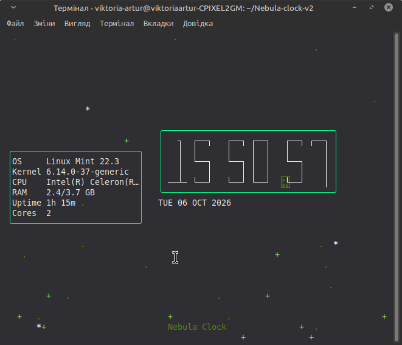

# Nebula Clock

A lightweight **Linux terminal clock + rice utility** written in Python.

Nebula Clock works out of the box with an automatic distro theme, but the user can also build a custom terminal layout through one JSON config.



## ✨ Features

- Automatic Linux distribution detection
- **109 built-in Linux distribution and edition themes**
- Large terminal clock with multiple fonts
- Animated star field
- Configurable colors
- Optional distro logo
- Optional logo animations
- **Mini Fetch** with CPU, RAM, kernel, uptime and more
- **Fetch Box**
- **Clock Box**
- Custom text below the clock
- 24-hour clock and seconds/date options
- Manual theme selection
- No external Python packages required

## 🚀 Quick start

Clone the repository and install it:

```bash
git clone https://github.com/a43039646-svg/Nebula-clock.git
cd Nebula-clock
chmod +x install.sh
./install.sh
```

After installation, the program is available as:

```bash
nebula-clock
```

If your shell says `nebula-clock: command not found`, add the local bin directory to your current session:

```bash
export PATH="$HOME/.local/bin:$PATH"
```

Then run:

```bash
nebula-clock
```

## ⚙️ Configuration

The normal first launch is intentionally simple. Extra features are optional.

Create the user config with:

```bash
nebula-clock --init-config
```

The file is:

```text
~/.config/nebula-clock/config.json
```

Example:

```json
{
  "theme": "auto",
  "display": {
    "show_seconds": true,
    "show_date": true,
    "show_title": false,
    "scale": "auto",
    "font": "digital"
  },
  "logo": {
    "enabled": true,
    "source": "auto",
    "position": "right"
  },
  "fetch": {
    "enabled": true,
    "box": true,
    "position": "left"
  },
  "clock_box": {
    "enabled": true,
    "style": "rounded"
  },
  "custom_text": {
    "enabled": true,
    "text": "Nebula Clock",
    "position": "bottom"
  },
  "colors": {
    "clock": "#FFFFFF",
    "date": "#FFFFFF",
    "box": "#00FF88",
    "logo": "#00FF88",
    "fetch": "#FFFFFF",
    "custom_text": "#00FF88"
  },
  "animation": {
    "stars": true,
    "logo": {
      "enabled": true,
      "type": "fade",
      "interval": 6.0,
      "duration": 2.5
    }
  }
}
```

You can enable only the parts you want. The config is an additional customization layer; the built-in distro themes are still used as ready-made presets.

## 🖋️ Clock fonts

Available clock fonts:

```text
digital
block
ascii
dot
thin
```

Set the font with:

```json
"font": "digital"
```

## 🐧 Distro logos

The logo can follow the detected distro automatically:

```json
"logo": {
  "enabled": true,
  "source": "auto",
  "position": "right"
}
```

Or you can choose one manually:

```json
"source": "debian"
```

Custom logo text is also supported through `source: "custom"` and the `custom` field.

## 📦 Mini Fetch and Boxes

Enable Mini Fetch:

```json
"fetch": {
  "enabled": true,
  "box": true,
  "position": "left"
}
```

Enable a box around the clock:

```json
"clock_box": {
  "enabled": true,
  "style": "rounded"
}
```

Supported box styles:

```text
single
double
rounded
ascii
```

## 🎨 Animations

Stars are enabled by default. Decorative elements can also use simple animation modes such as:

```text
none
blink
pulse
fade
slide
```

Example:

```json
"animation": {
  "logo": {
    "enabled": true,
    "type": "fade",
    "interval": 6,
    "duration": 2.5
  }
}
```

## 🖥️ CLI

```bash
nebula-clock
nebula-clock --theme arch
nebula-clock --list-themes
nebula-clock --print-theme
nebula-clock --init-config
nebula-clock --no-seconds
nebula-clock --no-stars
nebula-clock --clock-box
nebula-clock --fetch
nebula-clock --fetch-box
nebula-clock --logo auto
nebula-clock --font digital
nebula-clock --once
```

Press `Q`, `Esc` or `Ctrl+C` to exit.

## 🎭 Themes

The repository contains **109 built-in theme files** in:

```text
nebula_clock/themes/
```

The themes are ready-made distro presets. Configuration lets users customize them instead of replacing them.

## 🧩 Project structure

```text
nebula_clock/
├── main.py        # CLI and program entry point
├── config.py      # configuration and distro detection
├── render.py      # clock, boxes, layout and rendering
├── effects.py     # stars and decoration animations
├── fetch.py       # Mini Fetch system information
├── logos.py       # distro logo glyphs and fallbacks
└── themes/        # built-in distro themes
```

## 📋 Requirements

- Linux
- Python 3.10+
- A terminal with Unicode support is recommended

## 📜 License

Eclipse Public License 2.0. See [LICENSE](LICENSE).
